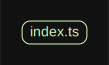

# 源码分析

## 文件结构

``` bash
/Users/liufang/openSource/FunnyLiu/p-queue
├── bench.ts
├── license
├── package.json
├── readme.md
├── source
|  ├── index.ts
|  ├── lower-bound.ts
|  ├── options.ts
|  ├── priority-queue.ts
|  └── queue.ts
└── tsconfig.json

directory: 1 file: 11

ignored: directory (1)

```

## 外部模块依赖

请在： http://npm.broofa.com?q=p-queue 查看

## 内部模块依赖


  